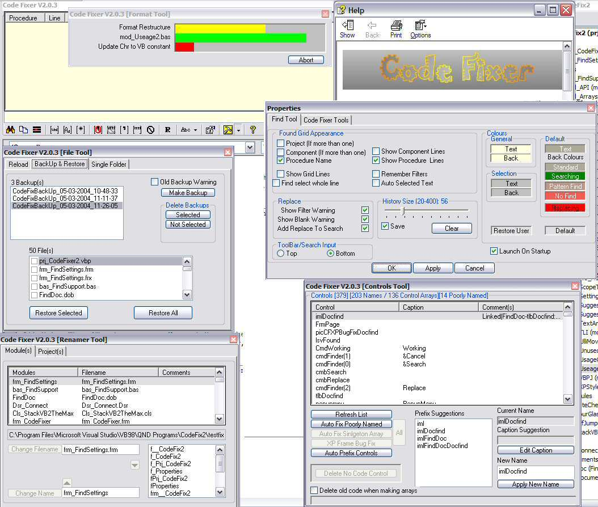



## CODE FIXER 2\.9\.9

### Description

NEW VERSION 3 NOW AT http://www.pscode.com/vb/scripts/ShowCode.asp?txtCodeId=59247&lngWId=1

Will leave this here as a safety for a couple of weeks.

This is a VB6 ( SP5 or SP6 required for ListView to work properly , Thanks Ariel) Add-In which allows you to indent code, find and repair/improve code for greater efficiency and readability and includes a user friendly replacement for VB's Find And Replace Tool.

----

v2.9.9 several small tweaks mostly rare conditions or recent stuffups (See history.txt for details).

----

Quick search for 'CODE FIXER HELP

FILE' to get the help file (You will need it!)

The Find Tool component is designed to be permanently docked with the VB IDE(See Launch on Startup button on Settings screen). While this takes screen real estate, unlike VB's own find tool, it doesn't hide the code. I find it easiest to use if docked at top of the IDE under the VB toolbars.

----

WARNING

All care; No responsibility. Some of the fixes the Add-In performs are capable of damaging code. Please use on copies of your code or use the built-in backup systems.

----

See readmeCodeFixer.txt in zip for installation instructions.

----

All bug reports gratefully recieved. If you have sent me one previously please check if I have patched it and let me know if not.

----

Thanks to Ulli for original inspiration and to the many who have assisted me with bug reports (you should find your name somewhere in the code, the thanks.rtf has been removed to keep the zip size down).

----

NEW NEW NEW NEW

New item on CF menu 'Fix & Format (Ctrl Def Prop)': Because of the way it works the Default Property fix can be very slow, is unlikely to be needed more than once per project but it requires data gathered during the normal fix cycle. I know its an ugly menu item but until I think of a different, way to present this will do.
 
### More Info
 

             |
---                |---
**Submitted On**   |2005-02-25 14:33:08
**By**             |[Roger Gilchrist](https://github.com/Planet-Source-Code/PSCIndex/blob/master/ByAuthor/roger-gilchrist.md)
**Level**          |Advanced
**User Rating**    |4.9 (276 globes from 56 users)
**Compatibility**  |VB 6\.0
**Category**       |[Complete Applications](https://github.com/Planet-Source-Code/PSCIndex/blob/master/ByCategory/complete-applications__1-27.md)
**World**          |[Visual Basic](https://github.com/Planet-Source-Code/PSCIndex/blob/master/ByWorld/visual-basic.md)
**Archive File**   |[CODE\_FIXER1857262242005\.zip](https://github.com/Planet-Source-Code/roger-gilchrist-code-fixer-2-9-9__1-53297/archive/master.zip)

